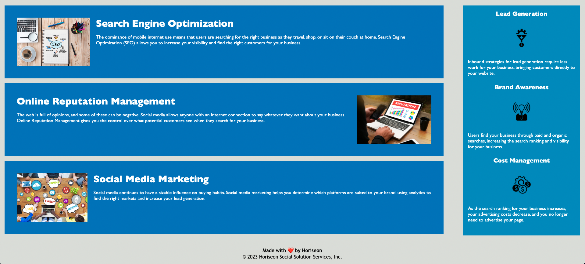

# Marketing Agency Accessibility Improvements: wk-1-challenge

## Description
The purpose of this project is to refactor an existing code base in order to meet a set of accessibility standards. Relevant client is Marketing Agency. 

## Requirements
- Ensure semantic HTML elements are used
- Ensure HTML elements follow logical structure independent of styling and positioning
- Ensure images have relevant alt attributes
- Ensure heading attributes fall in sequential order
- Ensure title element is concise and descriptive

## Scout Rule: Additional Improvements
- Consolidated CSS selectors and properties
- Commented CSS code where relevant
- Ensured that links are functioning correctly

## Webpage Preview

## Link to Deployed Application
[Deployed Webpage](https://www.google.com/)
